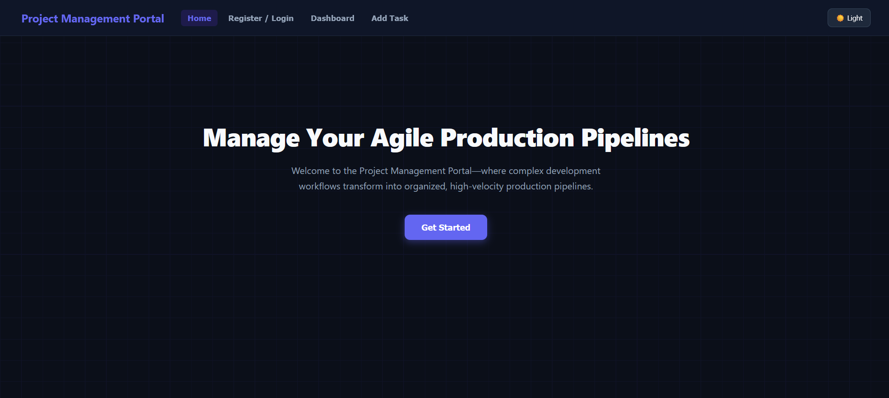

# 📌 Portal Management System (MERN Stack)

A full-stack web application built using the **MERN stack (MongoDB, Express, React, Node.js)** for managing users and tasks with authentication and CRUD operations.

---

## 🚀 Features

- 🔐 User Authentication (Login / Register)
- 👤 Role-based access control (Admin / User)
- 📝 Create, Read, Update, Delete (CRUD operations)
- 📊 Dashboard for managing tasks and data
- 🌐 REST API integration between frontend and backend
- 📱 Fully responsive UI design

---

## 🛠️ Tech Stack

- **Frontend**
  - React.js
  - Axios
  - CSS / Bootstrap (if used)

- **Backend**
  - Node.js
  - Express.js

- **Database**
  - MongoDB

---

## 📁 Project Structure

- project-root/
  - frontend/
    - src/
    - components/
    - pages/
    - services/
  - backend/
    - routes/
    - controllers/
    - models/
    - config/
  - README.md

---

## ⚙️ Setup Instructions

### 📥 Clone the Repository

- git clone https://github.com/YOUR_USERNAME/YOUR_REPO_NAME.git

---

### 🖥️ Backend Setup

- cd backend
- npm install

- Create `.env` file:
  - PORT=5000
  - MONGO_URI=your_mongodb_connection_string
  - JWT_SECRET=your_secret_key

- Start backend server:
  - npm start

---

### 💻 Frontend Setup

- cd frontend
- npm install
- npm start

---

## 🌐 API Endpoints

- POST /api/auth/register → Register user
- POST /api/auth/login → Login user
- GET /api/tasks → Get all tasks
- POST /api/tasks → Create task
- PUT /api/tasks/:id → Update task
- DELETE /api/tasks/:id → Delete task

---

## 📸 Screenshots

- 
- 

---

## 👨‍💻 Author

- Name: Yuvaneswari Gunalan

